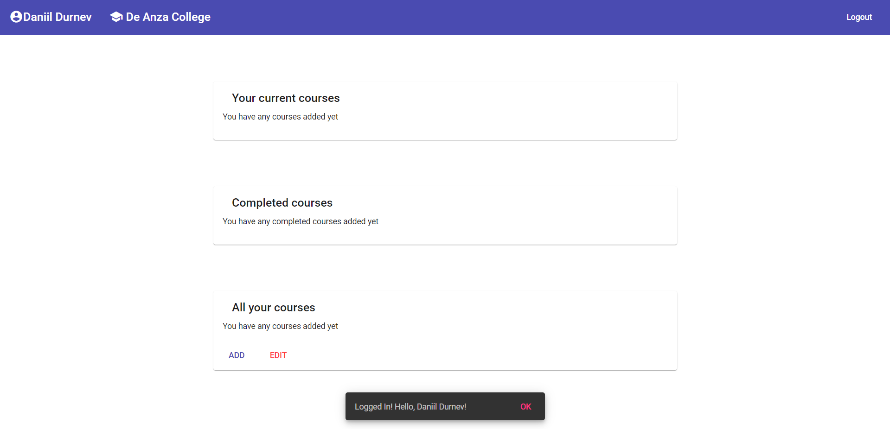
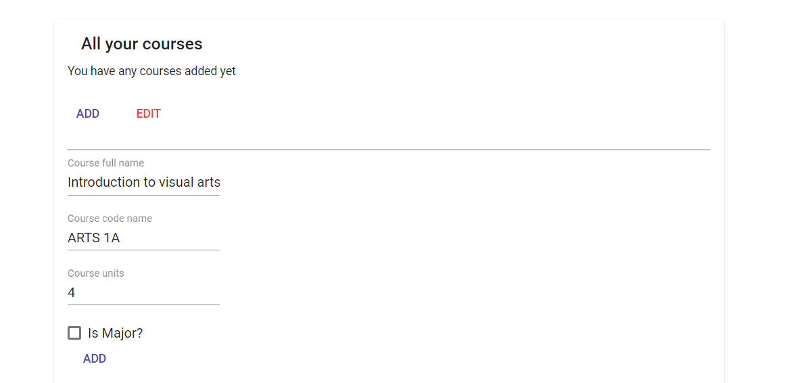
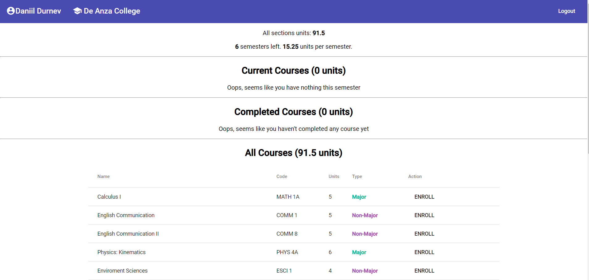

# ClassOrganizer

This project uses Angular & Spring (REST communication between client & server).

The app allows you to organize all your college courses, moreover, in future there will be a calculator implemented. So you can get an advice about how many courses to take each semester.

